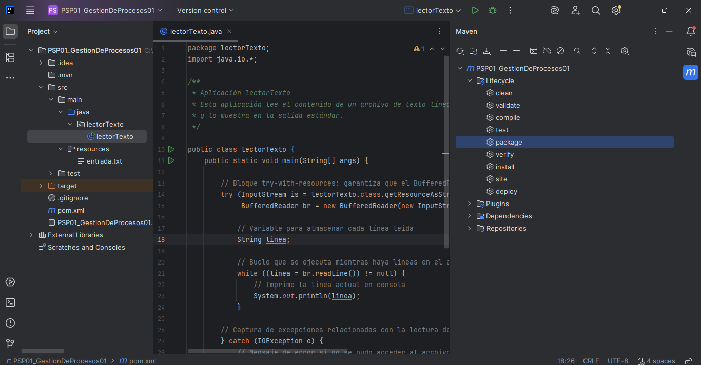
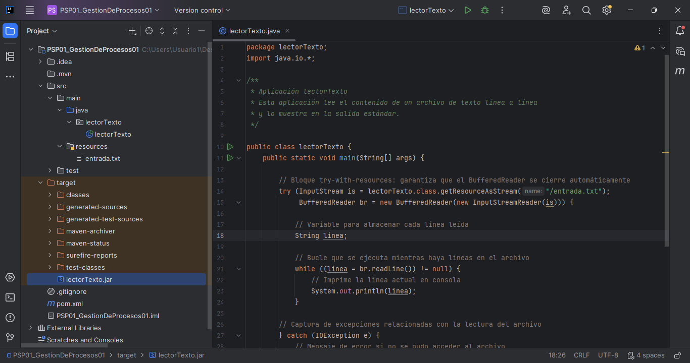
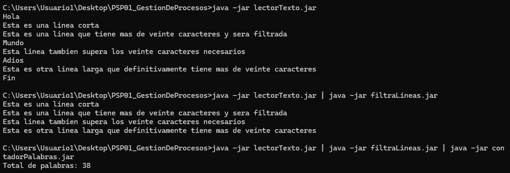
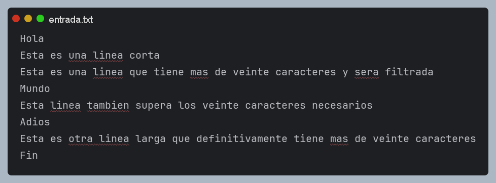

# 📚 Tarea PSP01: Gestión de Procesos 1
> **Asignatura:** Programación de Servicios y Procesos  
> **Autor:** Gabriel Sánchez Heredia  
> **Fecha:** Octubre 2025  

---

## 📋 Descripción del Proyecto

Este proyecto implementa tres aplicaciones Java que trabajan con entrada/salida estándar y pueden encadenarse mediante tuberías para procesar archivos de texto:

1. **LectorTexto** - Lee un archivo de texto línea a línea
2. **FiltraLineas** - Filtra líneas con más de 20 caracteres
3. **ContadorPalabras** - Cuenta el total de palabras

---

## ⚙️ Requisitos Previos

- **Java JDK** 8 o superior
- **Maven** 3.6 o superior
- **IDE:** IntelliJ IDEA
- Terminal/Símbolo del sistema
- Sistema operativo: Windows, Linux o macOS

---

## 🔨 Compilación del Proyecto

Este proyecto utiliza **Maven** como herramienta de construcción. La compilación se realiza desde el IDE.

### Compilar desde IntelliJ IDEA

1. Abre el proyecto en IntelliJ IDEA
2. Abre la ventana **Maven** (View → Tool Windows → Maven)
3. Expande el proyecto → **Lifecycle**
4. Haz doble clic en **package**


> **Resultado:** Los archivos `.jar` ejecutables se crean en la carpeta `target/`

---

## 📦 Configuración de Maven (pom.xml)

Para generar JARs ejecutables, necesitas configurar el `pom.xml` con el plugin `maven-jar-plugin`:

Ejemplo:

```xml
<project xmlns="http://maven.apache.org/POM/4.0.0" xmlns:xsi="http://www.w3.org/2001/XMLSchema-instance"
  xsi:schemaLocation="http://maven.apache.org/POM/4.0.0 http://maven.apache.org/xsd/maven-4.0.0.xsd">
  <modelVersion>4.0.0</modelVersion>

  <groupId>org.example</groupId>
  <artifactId>PSP01_GestionDeProcesos01</artifactId>
  <version>1.0-SNAPSHOT</version>
  <packaging>jar</packaging>

  <name>PSP01_GestionDeProcesos01</name>
  <url>http://maven.apache.org</url>

  <properties>
    <project.build.sourceEncoding>UTF-8</project.build.sourceEncoding>
  </properties>

  <build>
        <finalName>lectorTexto</finalName>
        <plugins>
            <plugin>
                <!-- Build an executable JAR -->
                <groupId>org.apache.maven.plugins</groupId>
                <artifactId>maven-jar-plugin</artifactId>
                <version>3.4.1</version>
                <configuration>
                    <archive>
                        <manifest>
                            <mainClass>lectorTexto.lectorTexto</mainClass>
                        </manifest>
                    </archive>
                </configuration>
            </plugin>
            <plugin>
                <groupId>org.apache.maven.plugins</groupId>
                <artifactId>maven-compiler-plugin</artifactId>
                <configuration>
                    <source>7</source>
                    <target>7</target>
                </configuration>
            </plugin>
        </plugins>
    </build>

  <dependencies>
    <dependency>
      <groupId>junit</groupId>
      <artifactId>junit</artifactId>
      <version>3.8.1</version>
      <scope>test</scope>
    </dependency>
  </dependencies>
</project>
```

---

## 🚀 Ejecución de las Aplicaciones

### 📝 Preparación: Crear archivo de entrada

Crea un archivo `entrada.txt` en el directorio raíz del proyecto con contenido de prueba.

**Ejemplo de contenido:**
```text
Hola
Esta es una linea corta
Esta es una linea que tiene mas de veinte caracteres y sera filtrada
Mundo
Esta linea tambien supera los veinte caracteres necesarios
Adios
Esta es otra linea larga que definitivamente tiene mas de veinte caracteres
Fin
```

---

## 🔧 Ejecución Independiente

### 1️⃣ LectorTexto

Lee el archivo `entrada.txt` y muestra su contenido por pantalla.

**Comando:**
```bash
java -jar lectorTexto.jar
```

**Salida esperada:**
```
Java es un lenguaje de programación orientado a objetos muy popular
Hola
Mundo
Esta línea tiene exactamente veintiun caracteres en total
...
```

**Manejo de errores:**
Si `entrada.txt` no existe, mostrará:
```
Error: No se pudo leer el archivo.
Asegúrate de que el archivo existe en el directorio actual.
```

---

### 2️⃣ FiltraLineas

Lee el archivo `entrada.txt` y muestra solo líneas con más de 20 caracteres.

---

### 3️⃣ ContadorPalabras

Lee el archivo `entrada.txt` y cuenta el total de palabras.

---

## 🔗 Ejecución con Tuberías
Las tuberías (`|`) conectan la salida estándar de un programa con la entrada estándar del siguiente.

### Tubería Simple: Lector → Filtro

```bash
java -jar lectorTexto.jar | java -jar filtraLineas.jar
```

**Resultado:** Muestra solo las líneas del archivo con más de 20 caracteres.

**Ejemplo de salida:**
```
Esta es una linea corta
Esta es una linea que tiene mas de veinte caracteres y sera filtrada
Esta linea tambien supera los veinte caracteres necesarios
Esta es otra linea larga que definitivamente tiene mas de veinte caracteres
```

---

### Tubería Simple: Lector → Contador

```bash
java -jar lectorTexto.jar | java -jar contadorPalabras.jar
```

**Resultado:** Cuenta todas las palabras del archivo.

**Ejemplo de salida:**
```
Total de palabras: 42
```

---

### 🎯 Tubería Completa: Lector → Filtro → Contador

```bash
java -jar lectorTexto.jar | java -jar filtraLineas.jar | java -jar contadorPalabras.jar
```

**Flujo de datos:**
1. `LectorTexto` lee todas las líneas de `entrada.txt`
2. `FiltraLineas` recibe las líneas y pasa solo las que tienen > 20 caracteres
3. `ContadorPalabras` cuenta las palabras de las líneas filtradas

**Ejemplo de salida:**
```
Total de palabras: 38
```

---

## 🖼️ Capturas de Pantalla

### 1. Compilación con Maven (Lifecycle → package)

*Captura mostrando el proceso de package en el IDE*

### 2. Archivos JAR generados en target/

*Captura de un archivo .jar de ejemplo en la carpeta target/*

### 3. Ejecución tuberías: Lector → Filtro → Contador

*Captura de las tres aplicaciones encadenadas*

### 4. Contenido del archivo entrada.txt

*Captura del contenido del archivo de prueba*
